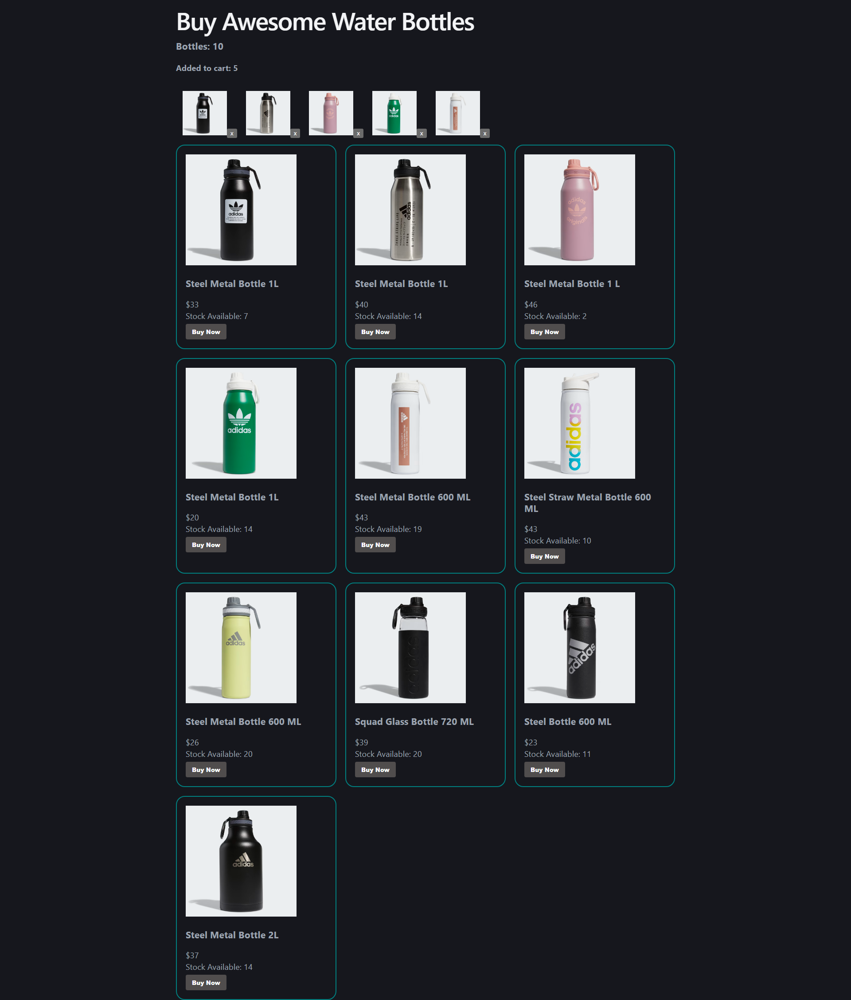

## 🛍️ Buy Awesome Water Bottles

A modern e-commerce-style React application where users can browse water bottles and add them to their cart. This project is built using fake data to demonstrate core React concepts like state management, component structure, and dynamic UI updates.

## 🚀 Features

🧴 Display all available water bottles

🛒 Add items to cart

❌ Remove items from cart

🔢 Dynamic cart count update

📦 Stock availability tracking

⚡ Fast performance with React

# Clone the repository

```
git clone https://github.com/mahabubalam-gbs/awesome-water-bottles.git
```

# 💡 Learning Goals

This project helped in understanding:

React component structure

Props & state management

Handling events (add/remove cart)

Conditional rendering

Working with fake JSON data


# Author

Md Mahabub Alam
```
https://github.com/mahabubalam-gbs
```

## Project Screenshots


